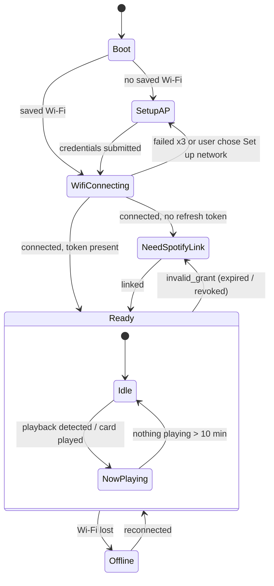
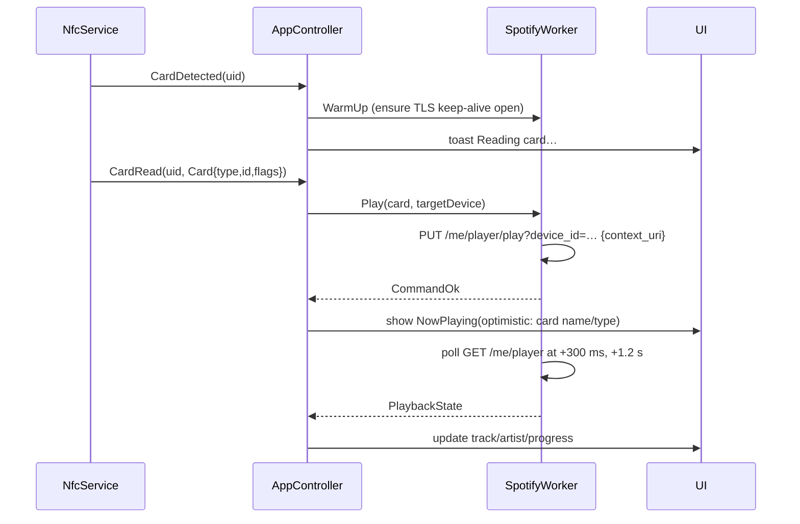
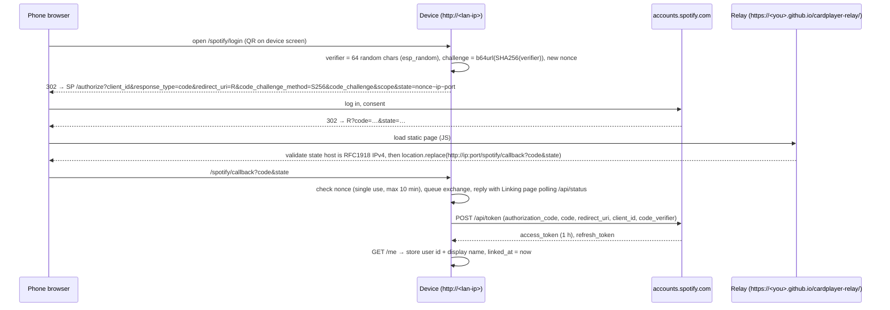

# Card Player — NFC Spotify Controller: Implementation Plan

Status: **Phase 0 done (gate G1 passed); Phase 1 in progress** · Date: 2026-09-29
Target hardware: Waveshare ESP32-S3-Touch-LCD-1.47 + PN532 NFC V3 module + MIFARE Classic 1K cards (nothing else)

---

## 0. Summary

A small landscape touchscreen box. Tap an NFC card and the album, playlist, artist, podcast or Liked Songs stored on it starts playing on your chosen Spotify Connect speaker. The screen shows what's playing and has large, forgiving controls. A menu lets you pick the target speaker, write new cards and change Wi-Fi. First-time setup happens from a phone: the device runs its own Wi-Fi access point and captive portal, then you link Spotify with a QR code.

### Decisions at a glance

| # | Topic | Decision | Status |
|---|-------|----------|--------|
| D1 | Framework | PlatformIO + **pioarduino** (Arduino core 3.3.x on ESP-IDF 5.5) | Decided by user |
| D2 | Spotify login | OAuth **Authorization Code + PKCE** via a **static HTTPS relay page** (GitHub Pages), with manual paste fallback | Decided by user |
| D3 | Card data | **NDEF URI record** `https://open.spotify.com/<type>/<id>` on MIFARE Classic (NFC Forum MAD layout) | Decided by user |
| D4 | Spotify account | Owner has **Premium**; **one** linked account | Decided by user |
| D5 | Orientation | **Landscape 320×172** | Decided by user |
| D6 | Power | **USB, always on**; screen dims/sleeps, NFC keeps polling | Decided by user |
| D7 | v1 extras | **Volume**, **shuffle & repeat**, **more card types** (artist, podcast/show, Liked Songs). *No album art in v1.* | Decided by user |
| D8 | UI toolkit | **LVGL 9.5.x**, hand-coded screens | Recommended (§4.2) |
| D9 | Display/touch driver | **Arduino_GFX** + Waveshare JD9853 init sequence; vendored Waveshare **AXS5106L** touch driver | Recommended (§4.2) |
| D10 | NFC stack | **Seeed_Arduino_NFC** (PN532 driver + Don Coleman NDEF), **SPI** on a dedicated bus | Recommended (§4.3) |
| D11 | Spotify client | **Own thin REST client** on HTTPClient + ArduinoJson 7 (≈10 endpoints) | Recommended (§4.4) |
| D12 | Web/provisioning | **ESPAsyncWebServer + DNSServer** custom captive portal (one web stack for setup, Spotify linking, settings, OTA) | Recommended (§4.5) |
| D13 | OTA | Own upload handler (`Update` API) in portal + ArduinoOTA for dev | Recommended (§4.8) |
| D14 | Power saving | Screen-off power profile: RF field off between card searches, slower card search (750 ms), LCD panel sleep with rendering paused, Spotify polling stopped, Wi-Fi max modem sleep, CPU at 80 MHz (§9.5) | Decided by user |
| D15 | Playback from other devices | With the screen on, Idle checks every 5 s for music playing anywhere on the account and switches to Now Playing. Controls act on the playing device; cards still play on the saved speaker. A paused session stays on Idle with Resume. The screen stays on while music plays (§6.8) | Decided by user |

The "Recommended" rows are my calls, each with pros and cons in §4. Change any of them before Phase 1 if you disagree.

---

## 1. Scope

### In scope (v1)
- **Play from card:** read the NDEF URL, then start playback on the target device. Supported: album, playlist, artist, show (podcast), Liked Songs.
- **Now Playing:** context name (album or playlist name), track title, artist, progress, play/pause, previous, next. Also volume, shuffle and repeat.
- **Pick up music started elsewhere:** music playing anywhere on the account (phone, desktop, a speaker's app) shows on Now Playing and can be controlled from the device (§6.8).
- **Speakers menu:** list the available Spotify Connect devices, cycle through them, select one, and transfer playback to it. The choice is remembered.
- **Write-card mode:** place a card, play something in the Spotify app, tap **Record**. The device writes the URL, verifies it, and asks before overwriting an existing card.
- **Wi-Fi:** first-boot SoftAP with a captive portal, up to 3 saved networks, and a "Set up network" menu entry that reopens the portal.
- **Spotify link management:** link, re-link and unlink. Shows a countdown to the 6-month token expiry.
- **Settings:** brightness, dim/off timers, card behaviours, admin password, factory reset.
- **OTA firmware update:** from the web portal.
- **Diagnostics:** logs, heap, and an About screen.

### Out of scope for v1 (planned later)
- Album art. The design leaves room for it, and the TF card slot is reserved as its cache.
- Multiple Spotify accounts.
- Writing cards from a pasted link in the web portal (Phase 9, optional).
- On-device Wi-Fi password keyboard. Phone entry is kinder on a 1.47" screen.
- CJK/Arabic/other non-Latin glyph coverage beyond Latin, Greek and Cyrillic (§9.6).
- Battery operation.

---

## 2. Prerequisites (one-time, user)

1. **Spotify Premium** on the account that owns the developer app. Required for Development Mode apps since Feb 2026, and the playback-control endpoints only work for Premium users.
2. **Spotify developer app** at developer.spotify.com/dashboard:
   - APIs used: Web API.
   - Redirect URIs:
     - `https://<you>.github.io/cardplayer-relay/` (the relay, §6.2)
     - `http://127.0.0.1:8888/callback` (fallback)
   - Copy the **Client ID**. No client secret is needed because the flow uses PKCE.
   - Avoid the word "Spotify" in the app name; Spotify's developer branding rules restrict it.
   - Dev-mode limits: new apps get 1 Client ID per developer and 5 users per app. One account is well within this.
3. **Relay page hosting:** a GitHub account with Pages enabled. The repo ships `relay/index.html` plus a Pages workflow. Cloudflare Pages or Netlify also work; the relay URL is configurable on the device.
4. **A Spotify Connect target** that stays discoverable, such as a smart speaker, TV, desktop app or Sonos. A phone app only shows up in the device list while it's open.

---

## 3. Hardware

### 3.1 Board pin map

Source: Waveshare schematic and vendor demos (`ESP32-S3-Touch-LCD-1.47-Schematic.pdf`, `ESP32-S3-Touch-LCD-1.47-Demo.zip`). Where the two conflict, **the schematic wins**.

| Function | GPIO | Notes |
|---|---|---|
| LCD SCLK | 38 | SPI2 (FSPI), JD9853, 4-wire SPI, no MISO |
| LCD MOSI | 39 | |
| LCD CS | 21 | |
| LCD DC | 45 | Strapping pin (fine as output after boot) |
| LCD RST | **40** | Vendor Arduino hello-world wrongly passes 47; use 40 |
| LCD backlight | 46 | Drives an NPN transistor, active high, LEDC PWM 5 kHz/10-bit (vendor) |
| Touch SDA / SCL | 42 / 41 | I²C, AXS5106L @ **0x63**. Also broken out on header P1.12 / P1.10 |
| Touch RST | **47** | Schematic `TP_RST=IO47`. Vendor IDF BSP has INT/RST swapped; Arduino demo matches the schematic |
| Touch INT | **48** | |
| TF card (SDMMC 4-bit) | CLK 16, CMD 15, D0 17, D1 18, D2 13, D3 14 | Unused in v1 |
| Battery ADC | 12 | 200k/100k divider; unused (USB power) |
| BOOT button (Key2) | 0 | Usable as a user button after boot (§9.4). Holding it at reset enters download mode |
| RESET button (Key1) | EN | |
| USB D−/D+ | 19 / 20 | Native USB-Serial-JTAG (CDC) |
| Octal PSRAM | 33–37 | Unavailable |
| UART0 TX/RX | 43 / 44 | On header P1.5 / P1.7 |

**Free GPIOs for us: IO1–IO11** (header), plus IO43/44.

### 3.2 Header P1 (2×11)

| Pin | Signal | Pin | Signal |
|---|---|---|---|
| 1 | VBUS (5 V) | 2 | VBAT |
| 3 | GND | 4 | GND |
| 5 | TXD (IO43) | 6 | GND |
| 7 | RXD (IO44) | 8 | **3V3** |
| 9 | EN | 10 | SCL (IO41, touch bus) |
| 11 | IO1 | 12 | SDA (IO42, touch bus) |
| 13 | IO2 | 14 | IO11 |
| 15 | IO3 | 16 | IO10 |
| 17 | **IO4** | 18 | IO9 |
| 19 | **IO5** | 20 | **IO8** |
| 21 | **IO6** | 22 | **IO7** |

### 3.3 PN532 wiring (SPI, dedicated bus SPI3/HSPI)

Set the PN532 V3 interface switches to **SPI: I0 = OFF/L, I1 = ON/H**. Check the silkscreen on your module; HSU is L/L and I²C is H/L.

| PN532 pin | ESP32-S3 | Header pin |
|---|---|---|
| VCC | 3V3 | P1.8 |
| GND | GND | P1.6 |
| SCK | IO4 | P1.17 |
| MISO | IO5 | P1.19 |
| MOSI | IO6 | P1.21 |
| SS (NSS) | IO7 | P1.22 |
| IRQ | IO8 | P1.20 (optional; used for interrupt-driven detection later) |
| RSTO | not connected | This is a reset *output* on V3 modules |

- **Why this layout:** it avoids strapping pin IO3, and pins 17–22 sit together at the end of the header so the harness is short. For the HSU fallback, reuse IO4 (ESP TX → PN532 RX) and IO5 (ESP RX ← PN532 TX) with the switches at L/L.
- **SPI clock:** the PN532 maximum is 5 MHz. The Seeed driver sets 2 MHz (`SPI_CLOCK_DIV8` is 2 MHz on Arduino core 3.3.12); spike S2 also tests 1 and 4 MHz.
- **Power:** 3V3 keeps logic levels native. Spike S1 measures 3V3 rail droop with Wi-Fi TX, backlight at 100% and the RF field on. If it browns out, power the module from VBUS (5 V) **only** if the module's I/O stays at 3.3 V (verify with a meter).
- **Mechanical:** the PN532's effective range is under 5 cm. Keep the antenna away from metal, the LCD's back and the USB cable. Mark the "tap here" spot on the enclosure.

### 3.4 Hardware notes and discrepancies to respect
- The IDF BSP includes a QMI8658 IMU source, but the schematic has no IMU. Ignore it.
- The vendor Arduino example drives the JD9853 with `Arduino_ST7789` plus a custom register init sequence (`lcd_reg_init`). Keep that sequence byte-for-byte. Column offset is 34 in portrait; **re-verify offsets after rotating to landscape** (spike S1).
- The LCD runs stably at 80 MHz on Arduino_GFX (verified in spike S1: full-screen fill 12.6 ms vs 23.6 ms at 40 MHz; LVGL full redraw 38.5 ms vs 49.3 ms). Set the clock once at boot; re-clocking a running SPI bus has no effect.

---

## 4. Software stack and decisions (with pros/cons)

### 4.1 Framework: PlatformIO + pioarduino (decided)
- **Pros**
  - Largest library ecosystem: PN532/NDEF, LVGL, ArduinoJson, async web server.
  - The vendor Arduino demos run as-is.
  - IDF APIs (esp_lcd, mbedTLS, NVS, heap_caps, FreeRTOS) are still callable directly.
- **Cons**
  - The official `platformio/espressif32` platform is stuck on Arduino 2.x, so we depend on the community **pioarduino** platform.
  - sdkconfig is precompiled, so there are limited knobs. For example, mbedTLS buffers can't easily move to PSRAM.
- **Mitigation:** pin an exact pioarduino release URL in `platformio.ini`. Keep IDF-specific calls behind thin wrappers.

### 4.2 Graphics
**LVGL 9.5.x (recommended)**
- Pros: current API, faster renderer, `lv_qrcode` built in (needed for setup QR codes), active support.
- Cons: the vendor demo uses 8.4, so we write our own ~40-line flush and touch glue instead of copying it.
- Alternatives:
  - **LVGL 8.4:** vendor-proven, but in maintenance-only mode.
  - **LVGL 9.6.0:** released 2026-09-16. Faster, but restructures config and headers; re-evaluate after v1.

**Hand-coded screens (recommended) vs EEZ Studio / SquareLine**
- Pros: reviewable diffs, no generator lock-in, easy to adapt to dynamic data.
- Cons: no WYSIWYG. That's acceptable for about 10 simple screens.

**Display driver: Arduino_GFX 1.6.8 + vendor JD9853 init (recommended)**
- Pros: exactly what Waveshare ships and tests; lowest bring-up risk.
- Cons: blocking bitmap push, though that's trivial at 172×320: about 11 ms per full frame at 80 MHz.
- Alternative: **esp_lcd + vendor `esp_lcd_jd9853` C component** copied into `lib/`. Gives async DMA flush, but the vendor proved it only in the IDF build. Keep it as a fallback if tearing or performance issues appear.

**Touch: vendor `esp_lcd_touch_axs5106l` Arduino driver, reworked into `lib/board/` (`Touch.cpp`)**
- Has no registry package. Keep attribution, pin the copy, and fix the landscape rotation mapping.

### 4.3 NFC
**Seeed_Arduino_NFC (recommended)**
- Pros:
  - The only mainstream Arduino stack that bundles PN532 transport (SPI/I²C/HSU) with full **NDEF on MIFARE Classic**: MAD formatting, multi-sector read/write and clean.
  - Transport is swappable at compile time.
- Cons:
  - Older codebase with AVR-era SPI calls. (Checked: on core 3.3.12 `SPI_CLOCK_DIV8` is 2 MHz, within the PN532 limit.) `NfcAdapter::begin()` halts forever if no PN532 answers, so check the firmware version first. Its `SAMConfig()`, `setPassiveActivationRetries()` and `setRFField()` report failure on success (they test `0 < responseLength`, but these replies carry no data), so send those commands directly and treat a non-negative length as success.
  - Verbose serial prints.
- Mitigation: pin the commit, patch the SPI setup with `SPISettings(1 MHz, LSBFIRST, MODE0)` if needed, and wrap it behind our `NfcService`.
- Alternative: **Adafruit_PN532**. Well maintained (SPI, I²C, UART, IRQ detection), but its NDEF helpers write a single sector with URLs of ≤ 38 chars. Our URLs are 45–53 bytes, so we'd have to write MAD and multi-sector NDEF ourselves. Keep it as the fallback transport if Seeed's SPI misbehaves.

**Interface: SPI (recommended)**

| Option | Pros | Cons |
|---|---|---|
| **SPI** | Dedicated bus (SPI3), fast, IRQ line available, best-tested | 5–6 wires |
| **HSU (UART)** | 2 wires, robust, no bus sharing | Slightly slower; library `begin()` may reset UART pins (verify) |
| I²C (share touch bus) | 2 wires, header already has SCL/SDA | PN532 clock-stretching quirks on ESP32; a PN532 hang could freeze **touch** too. **Not recommended** |

### 4.4 Spotify client
**Own thin client (recommended)**
- Pros:
  - Only about 10 endpoints are needed.
  - Full control of PKCE, **persistent keep-alive TLS** (the biggest latency win), ArduinoJson filters, 429/Retry-After handling, the 2026 API shapes and `invalid_grant` handling.
  - No third party sees the auth code.
- Cons: about 500 lines we own and maintain.

Alternatives:
- **SpotifyEsp32 (FinianLandes) v5:** actively maintained, but auth goes through the author's Cloudflare Worker and uses a **client secret**. That means a third-party dependency and exposure of the secret.
- **spotify-api-arduino (witnessmenow):** its auth flow expects an `http://<ip>` redirect, which Spotify no longer allows. It's also stale.

### 4.5 Wi-Fi provisioning and web portal
**Custom captive portal (recommended):** ESPAsyncWebServer (ESP32Async 3.9.x) + AsyncTCP + DNSServer + embedded, gzipped vanilla HTML/JS.
- Pros: one web stack serves setup, Spotify linking, settings, OTA and diagnostics; non-blocking.
- Cons: we write the pages, about 6 small pages.

Alternatives:
- **tzapu WiFiManager:** mature, but uses the synchronous WebServer. It would be a second web stack, and custom pages are awkward.
- **ESP-IDF `wifi_provisioning` + Espressif app:** polished, but needs an app and can't carry our Spotify and settings steps.
- **Improv Wi-Fi:** good for a browser-based flasher later; optional add-on.

### 4.6 Spotify login: relay page (decided). See §6.2.

### 4.7 Card format: NDEF URI (decided). See §7.

### 4.8 OTA
**Own `/update` upload handler using the `Update` API (recommended)**
- Pros: about 60 lines, no licence issues, works with our auth.

**ElegantOTA v3**
- Pros: pretty UI.
- Cons: AGPL-3.0 licence. Avoid if this might ever ship commercially.

ArduinoOTA stays enabled in the dev build only.

Later: pull-based OTA from GitHub Releases.

### 4.9 Storage
- **NVS (Preferences):** settings, Wi-Fi credentials, tokens (§10).
- **Web assets:** embedded in firmware as gzipped byte arrays, generated at build time by `scripts/embed_web.py`, rather than on LittleFS.
  - Pros: OTA updates are atomic (UI and firmware always match), and there's no filesystem flashing step.
  - Cons: rebuild to change the UI.
- **TF card:** not used in v1.

### 4.10 Library manifest (pin exact versions in Phase 0)

| Library | Version | Purpose |
|---|---|---|
| pioarduino platform-espressif32 | Arduino core 3.3.x / IDF 5.5.x (exact release URL) | Platform |
| lvgl/lvgl | 9.5.0 | UI |
| moononournation/GFX Library for Arduino | 1.6.8 (1.5.9, the vendor-tested version, fails to compile on core ≥ 3.3.6) | LCD driver |
| vendored `axs5106l` (Waveshare) | snapshot | Touch |
| Seeed-Studio/Seeed_Arduino_NFC | pinned git commit | PN532 + NDEF |
| bblanchon/ArduinoJson | 7.4.3 | JSON (filters, PSRAM allocator) |
| ESP32Async/AsyncTCP | 3.5.0 | Async TCP |
| ESP32Async/ESPAsyncWebServer | 3.12.1 | Portal |
| Core: WiFi, DNSServer, ESPmDNS, Preferences, Update, HTTPClient, NetworkClientSecure, mbedTLS (SHA-256) | core | |

---

## 5. Architecture

### 5.1 Modules

```
┌───────────────────────── UI task (core 1) ─────────────────────────┐
│ LVGL · ScreenManager · Screens · Theme · Toasts · QR               │
│   ▲ UiBridge (queue of UI updates, drained each LVGL loop)          │
└───┼────────────────────────────────────────────────────────────────┘
    │ view-model updates                 ▲ user intents (UiEvent)
┌───┴────────────────────── App task (core 1) ───────────────────────┐
│ AppController: single owner of AppState, state machine, policies    │
│ (card behaviour, device fallback, write mode, screen power)        │
└───┬──────────────▲──────────────────┬──────────────▲───────────────┘
    │ SpotifyCmd   │ SpotifyEvent     │ NfcCmd       │ NfcEvent
┌───▼──────────────┴──┐        ┌──────▼──────────────┴──┐   ┌──────────────────┐
│ SpotifyWorker (c0)  │        │ NfcService task (c0)    │   │ Net (c0)         │
│ Auth (PKCE, tokens) │        │ poll/detect, read NDEF, │   │ WifiManager, AP, │
│ Client (REST, TLS)  │        │ write/format/verify     │   │ DNS, mDNS, NTP,  │
│ Poller (adaptive)   │        │ CardCodec (URL<->Card)  │   │ Portal, OTA      │
└─────────────────────┘        └─────────────────────────┘   └──────────────────┘
          Settings (NVS) · Log (ring buffer) · HAL (Display, Touch, Backlight, Button)
```

**Rules**
- Only the UI task touches LVGL. Everyone else posts to `UiBridge`.
- Only `AppController` mutates `AppState`. Workers emit events and never call each other directly.
- Web handlers never block. They post commands and return; long operations (token exchange) are reported via `/api/status`.

### 5.2 Tasks

| Task | Core | Prio | Stack | Period / trigger |
|---|---|---|---|---|
| ui (LVGL `lv_timer_handler`) | 1 | 3 | 8 KB | ~5 ms |
| app (event loop) | 1 | 4 | 6 KB | Event queue |
| spotify worker | 0 | 3 | 12 KB (TLS) | Command queue + poll timer |
| nfc | 0 | 2 | 6 KB | Every 200 ms, or 750 ms with the screen off (50–100 ms `inListPassiveTarget` timeout) |
| net (Wi-Fi supervisor, DNS in AP mode) | 0 | 2 | 4 KB | 100 ms |
| AsyncTCP (library) | 0 | default | default | — |

A task watchdog covers ui, app, spotify and nfc.

### 5.3 App state machine



Overlays run on top of `Ready`: Menu, Speakers, WriteCard, Wi-Fi, Spotify account, Settings, About. **While WriteCard is open, card taps never trigger playback.**

"Playback detected" means `/me/player` reports `is_playing: true` on any of the account's devices (§6.8). A paused session keeps Idle.

### 5.4 Card tap → play (happy path)



**Latency budget:** detection ≤ 250 ms, read ≤ 150 ms (measured 83 ms), API call ≤ 500 ms on a warm TLS connection (measured 200–500 ms in spike S3; a new connection adds ~290 ms at 240 MHz, and `WIFI_PS_MAX_MODEM` adds ~200 ms, so wake to `MIN_MODEM` before calling). That gives **≤ 1.5 s p90** from tap to speaker, excluding the speaker's own start-up delay. On-screen feedback must appear within 200 ms of detection.

**From the Screen off profile (§9.5), allow ≤ 2.5 s p90.** Card search runs every 750 ms, and the TLS connection has usually closed because Spotify polling stops while dark. On `CardDetected`, switch to the Active profile first (CPU 240 MHz, lighter Wi-Fi power save), then warm up TLS in parallel with the card read.

### 5.5 Memory plan (8 MB PSRAM, ~320 KB usable internal)
- **LVGL draw buffers:** 2 × (320×40×2 B) = 51 KB, internal DMA-capable RAM.
- **LVGL heap and objects:** PSRAM via `LV_STDLIB_CUSTOM` → `heap_caps_malloc(MALLOC_CAP_SPIRAM)`.
- **ArduinoJson:** custom PSRAM allocator. Always use `DeserializationOption::Filter` on Spotify responses.
- **TLS:** mbedTLS in internal RAM, about 40–50 KB per session. Keep **at most two** sessions (`api.spotify.com` persistent, `accounts.spotify.com` on demand).
- **Fonts:** in flash (const).
- **Monitoring:** log `heap_caps_get_free_size` and the minimum-ever for internal and PSRAM every 60 s, and show them on About. The soak test checks that the minimums are stable.

### 5.6 Repository layout

```
SpotifyCdPlayer2/
  platformio.ini
  PLAN.md                     ← this file
  include/
    pins.h                    ← §3 pin map (single source of truth)
    config.h                  ← timings, limits, feature flags
    lv_conf.h
  src/
    main.cpp                  ← boot: HAL → settings → tasks
    app/        AppController.{h,cpp} AppState.h Events.h Policies.cpp
    hal/        BootButton.cpp (GPIO0 → util/ButtonGesture)
    ui/         UiBridge.cpp ScreenManager.cpp Theme.cpp Toast.cpp
                screens/ Boot Setup LinkSpotify Idle NowPlaying PlaybackPanel Menu Speakers WriteCard Wifi Account Settings About
    nfc/        NfcService.cpp CardCodec.{h,cpp}   ← CardCodec is pure logic (unit-tested)
    spotify/    SpotifyAuth.cpp (PKCE, tokens) SpotifyClient.cpp (REST) SpotifyWorker.cpp Models.h Parsers.cpp (pure, unit-tested)
    net/        WifiSupervisor.cpp SetupAp.cpp Portal.cpp Api.cpp Mdns.cpp TimeSync.cpp Ota.cpp
    storage/    Settings.{h,cpp}
    util/       Log.cpp ButtonGesture.cpp (pure) Backoff.cpp (pure) Base64Url.cpp Sha256.cpp Uri.cpp
    dev/        DevConsole.cpp  ← serial console, dev build only
  lib/board/                  ← display (Arduino_GFX + JD9853 init), AXS5106L touch (from the Waveshare driver), backlight
  lib/console/                ← line-based serial console (spikes + dev build)
  web/                        ← portal source (index.html, setup.html, app.js, style.css)
  relay/index.html            ← GitHub Pages OAuth relay (§6.2)
  .github/workflows/pages.yml ← deploys relay/
  scripts/embed_web.py        ← gzip web/ → src/net/web_assets.h (PlatformIO pre-script)
  scripts/fonts.md            ← lv_font_conv commands used
  assets/fonts/               ← generated LVGL fonts
  test/test_logic/            ← unit tests for pure modules; run on the PC (native) or the board (test_device)
  docs/ wiring.md spotify-setup.md user-guide.md spikes.md
```

### 5.7 platformio.ini (starting point)

```ini
[platformio]
default_envs = device

[env]
platform = https://github.com/pioarduino/platform-espressif32/releases/download/55.03.312-1/platform-espressif32.zip
framework = arduino
board = esp32-s3-devkitc-1
board_upload.flash_size = 16MB
board_upload.maximum_size = 16777216
board_build.flash_mode = qio
board_build.arduino.memory_type = qio_opi      ; ESP32-S3R8: quad flash + octal PSRAM
board_build.partitions = default_16MB.csv      ; 2 × ~6.25 MB OTA slots + coredump
monitor_speed = 115200
monitor_filters = esp32_exception_decoder
extra_scripts = pre:scripts/embed_web.py
build_flags =
  -DBOARD_HAS_PSRAM
  -DARDUINO_USB_MODE=1
  -DARDUINO_USB_CDC_ON_BOOT=1
  -DLV_CONF_INCLUDE_SIMPLE
  -Iinclude
lib_deps =
  lvgl/lvgl@9.5.0
  moononournation/GFX Library for Arduino@1.6.8
  bblanchon/ArduinoJson@7.4.3
  ESP32Async/AsyncTCP@3.5.0
  ESP32Async/ESPAsyncWebServer@3.12.1
  https://github.com/Seeed-Studio/Seeed_Arduino_NFC.git#3a55a631f23e986babf5e5fa625cc43d1bf99897

[env:device]
build_type = release
build_flags = ${env.build_flags} -DCORE_DEBUG_LEVEL=2

[env:dev]
build_type = release                            ; debug makes PlatformIO install OpenOCD and slows LVGL
build_flags = ${env.build_flags} -DCORE_DEBUG_LEVEL=3 -DENABLE_ARDUINO_OTA=1 -DENABLE_SERIAL_CONSOLE=1
                                                ; level 4 prints a pre-setup memory report that stalls boot without a monitor

[env:native]                                    ; host unit tests for pure logic
platform = native
test_framework = unity
build_src_filter = -<*>                         ; tests pull pure modules explicitly
```

---

## 6. Spotify integration

### 6.1 Constraints (verified September 2026)
- **Premium:** Development Mode apps need a Premium owner (since 2026-02-11). Player endpoints need a Premium user.
- **Dev mode limits:** new apps get 5 users per app and 1 Client ID per developer.
- **Redirect URIs:** HTTPS only, except loopback literals (`http://127.0.0.1`, `http://[::1]`). `localhost` and `http://192.168…` are **rejected**.
- **Refresh token lifetime:** refresh tokens expire **6 months after the original authorisation**, and refreshing doesn't extend them. This applies to all apps since 2026-07-20. On expiry the token endpoint returns `400 invalid_grant`, and the user must log in again.
- **Feb 2026 API changes:**
  - Player endpoints, Get Album, Get Playlist and Get Playlist Items remain available.
  - Playlist `tracks` was renamed to `items`.
  - Playlist *contents* are only returned for playlists you own or collaborate on (metadata still returns).
  - Batch endpoints and artist top-tracks were removed.
  - Search is capped at 10 results.
  - Several fields were removed (e.g. `user.product`, `popularity`, `available_markets`).
- **Spotify-owned playlists:** Spotify-owned editorial and algorithmic playlists have been restricted for apps created after Nov 2024. Spike S4 (2026-09-29): an editorial playlist **plays** from a `context_uri`; only its metadata (name) may be unavailable, so show "Playlist" when the name lookup fails.

### 6.2 Login flow: PKCE + static relay



**Relay page spec (`relay/index.html`, static, no secrets)**
- Parse `code`, `state` and `error` from the query string. `state` = `<nonce>~<ipv4>~<port>`.
- Forward **only** to private IPv4 addresses: `10/8`, `172.16/12` and `192.168/16`, with a numeric port. Anything else shows an error. This prevents the relay being used as an open redirect.
- Forward `error=access_denied` too, so the device can show "Login cancelled".
- **Fallback UI** (shown if not redirected within 2 s):
  - a **Continue** link, a user gesture in case a browser starts interstitialing public → private navigations (Chrome's Local Network Access explainer lists this as a possible future step);
  - a read-only box with the full callback URL and a **Copy** button, to paste into the device portal's "Paste login link" field.

**Manual fallback:** the device's Spotify page has a *Paste login link* box. It accepts either the relay's callback URL or the `http://127.0.0.1:8888/callback?code=…` URL. The device setting *Login method* chooses which `redirect_uri` to send: Relay (default) or Loopback.

**Scopes:**
- `user-read-playback-state`
- `user-modify-playback-state`
- `user-read-currently-playing`
- `user-read-private`
- `playlist-read-private`
- `playlist-read-collaborative`
- `user-library-read` (reserved; not needed now that Liked Songs plays as a context)
- `user-read-playback-position` (podcast resume)

**Browser notes (2026):**
- Chrome's HTTPS-by-default (Chrome 154, Oct 2026) initially exempts private IPs and `.local`, so `http://<lan-ip>` portal pages keep working.
- Local Network Access prompts currently apply to *subresource* requests from public pages. Top-level navigations are not yet gated. The relay only navigates; it never fetches the device.

### 6.3 Token lifecycle
- **Access token:** RAM only. Refresh proactively at 55 min, or on `401`, with a single retry.
- **Refresh token:** NVS. **Persist the rotated refresh token whenever one is returned.**
- **`linked_at`:** NVS. The Account screen shows "Re-link needed in N days". From 14 days out, the Idle screen shows a small banner.
- **`invalid_grant`:**
  - wipe the refresh token;
  - go to state `NeedSpotifyLink`;
  - the screen shows "Spotify login expired — scan to re-link" with a QR code for `http://<ip>/spotify/login`.
- **Clock:** sync time over NTP (`pool.ntp.org`, `time.google.com`) before any TLS call. It's needed for cert validity and expiry maths.

### 6.4 Endpoints used

| Purpose | Call | Notes |
|---|---|---|
| Playback state | `GET /v1/me/player?additional_types=episode` | Filter to device, is_playing, progress_ms, shuffle_state, repeat_state, context.uri/type, item (name, duration_ms, artists[].name, album.name/uri, show.name/uri) |
| Devices | `GET /v1/me/player/devices` | id, name, type, is_active, is_restricted, supports_volume, volume_percent |
| Transfer | `PUT /v1/me/player` `{device_ids:[id], play:<wasPlaying>}` | |
| Play card | `PUT /v1/me/player/play?device_id=<id>` `{context_uri}` or `{uris:[…]}` | |
| Resume / pause | `PUT /v1/me/player/play` / `PUT /v1/me/player/pause` | |
| Next / previous | `POST /v1/me/player/next` / `…/previous` | |
| Volume | `PUT /v1/me/player/volume?volume_percent=N` | Only if `supports_volume` |
| Shuffle | `PUT /v1/me/player/shuffle?state=true|false` | |
| Repeat | `PUT /v1/me/player/repeat?state=off|context|track` | |
| Names for write screen / non-album contexts | `GET /v1/playlists/{id}?fields=name,owner(id,display_name)`, `GET /v1/artists/{id}`, `GET /v1/shows/{id}` | Cache in a RAM LRU (32 entries) |
| Account | `GET /v1/me` | id, display_name |
| Tokens | `POST https://accounts.spotify.com/api/token` | `authorization_code` / `refresh_token` + `client_id` (PKCE, no secret) |

**HTTP layer**
- One persistent `NetworkClientSecure` to `api.spotify.com` with `HTTPClient::setReuse(true)`. Pre-warm it when a card is detected.
- Validate certificates with the ESP x509 **CA bundle** (not single pinned roots, which rotate). Arduino core 3.3.12 compiles in the full bundle: `NetworkClientSecure::useBuiltinCACertBundle()`.
- Timeouts: connect 5 s, read 5 s.
- Retries: exponential backoff with jitter.
- Honour `Retry-After` on `429`.
- Send `Content-Length: 0` on body-less PUT/POST (pause, next, previous, volume, shuffle, repeat). Arduino's `HTTPClient` omits the header for an empty body, and Spotify answers `411 Length Required` (spike S4).
- Keep one long-lived `HTTPClient` per host: its destructor closes the socket, so a per-request instance defeats keep-alive (spike S3).

### 6.5 Polling strategy (no push API exists)

| Situation | Interval |
|---|---|
| Screen on, playing | 1.5 s for 2 min after any touch, card tap or command; then 5 s, plus one poll timed for the end of the current track. Progress bar interpolated locally between polls. (The screen stays on for as long as music plays (§6.8), so polling at 1.5 s for hours would risk rate limits) |
| Right after a command | Extra polls at +300 ms and +1.2 s |
| Screen on (Active or Dim), idle or paused | 5 s. Picks up music started on another device (§6.8) |
| Write-card mode | 1 s (context changes must feel instant) |
| Screen off | Stopped. Poll immediately on wake (touch, card or BOOT) |
| After `429` | Pause for `Retry-After`, then double the interval for 5 min |

### 6.6 Error → UX mapping

| Condition | Detection | UX |
|---|---|---|
| No active device / target offline | `404 NO_ACTIVE_DEVICE`, or target missing from devices | If another device is active: "Play on *Living Room TV* instead?" [Yes] [Choose…]. Else open **Speakers** with the message "Pick a speaker" |
| Restricted device | `is_restricted`, or a `403` not matched below | Greyed in the list: "Can't be controlled remotely". If it's the device that's playing, Now Playing still shows the track but its controls are disabled with the same text |
| Volume not remotely controllable | `403 VOLUME_CONTROL_DISALLOW` (verified in spike S4), or `supports_volume: false` | Volume row disabled: "This speaker controls its own volume" |
| Premium required | `403 PREMIUM_REQUIRED` | Blocking screen explaining Premium |
| Token expired | `401` | Silent refresh, then retry once |
| Login expired | `invalid_grant` | Re-link screen with QR |
| Rate limited | `429` | Silent backoff; toast only if a user action is delayed > 2 s |
| Content unavailable | `404` / `403` on play | Toast: "This card's music isn't available (maybe removed or region-locked)" |
| Network / TLS failure | Client error | Toast "No connection — retrying"; top-bar icon shows offline |

### 6.7 Card type → playback

| Card URL | Play request | Name source |
|---|---|---|
| `…/album/{id}` | `context_uri: spotify:album:{id}` | `item.album.name` |
| `…/playlist/{id}` | `context_uri: spotify:playlist:{id}` | `GET /playlists/{id}?fields=name` |
| `…/artist/{id}` | `context_uri: spotify:artist:{id}` | `GET /artists/{id}` |
| `…/show/{id}` | `context_uri: spotify:show:{id}` (verified in spike S4) | `item.show.name` |
| `…/collection/tracks` (Liked Songs) | `context_uri: spotify:user:{userId}:collection` (verified in spike S4) | "Liked Songs" |

**Shuffle policy**
- Album cards force shuffle off by default (setting "Albums always play in order").
- A per-card flag in the URL query overrides it: `?sh=1` means shuffle on, `?sh=0` means shuffle off. Phones ignore unknown query parameters, so the card stays phone-compatible.
- With no flag, the device leaves shuffle as it was.

### 6.8 Picking up playback from other devices (decided, D15)
Music started anywhere on the account (phone app, desktop app, a speaker's own app) shows on the device and can be controlled from it.

- **Detection:** while the screen is on (Active or Dim) and Idle is showing, poll `GET /v1/me/player?additional_types=episode` every 5 s (§6.5), so music is picked up within 5 s. `204 No Content` means there's no session.
  - Why polling: Spotify's Web API has no push notifications. Its own apps use a private live connection, but that needs a different kind of login and breaks the developer terms, so it isn't used.
- **Playing** (`is_playing: true`): Idle → Now Playing (trigger `PlaybackStarted`).
- **Paused session** (`is_playing: false` with an `item`): stay on Idle and show "Last: <name>  [▶ Resume]". Resume sends `PUT /me/player/play` to that session's device. Only music that's actually playing takes over the screen.
- **Controls follow the playing device:** play/pause, previous, next, volume, shuffle, repeat and the BOOT short press act on the device in `/me/player` (`device.id`), not the saved speaker.
  - The chip reads "▶ Playing on <device> ▾" when that isn't the saved speaker; tapping it still opens Speakers.
  - Volume follows that device's `supports_volume` (§6.6).
  - If that device is `is_restricted`, the track still shows but the controls are disabled: "Can't be controlled remotely".
- **Cards don't follow:** a card tap always plays on the saved speaker, even while something plays elsewhere, so a card never starts music on someone's phone. If the saved speaker is missing, the §6.6 fallback applies. The saved speaker only changes in Speakers.
- **Screen stays on while playing** (§9.5):
  - While `is_playing` is true, the Dim and Screen off timers are held.
  - Newly detected playback brings Dim back to Active.
  - When playback pauses or stops, both timers restart from that moment.
  - Music started elsewhere while the screen is off isn't seen, because Spotify isn't polled while dark (D14). The next wake (touch, card or BOOT) polls at once and picks it up.

---

## 7. NFC and card format

### 7.1 On-card format
- **MIFARE Classic 1K, NFC Forum layout:**
  - sector 0 holds the MAD (key A `A0A1A2A3A4A5`);
  - data sectors use NFC Forum key `D3F7D3F7D3F7`;
  - the NDEF TLV starts at block 4.
- **One NDEF record:** TNF=Well-known, type `U`, prefix byte `0x04` (`https://`).
- **Payload examples**

  | Type | Payload | Bytes |
  |---|---|---|
  | Album | `open.spotify.com/album/4LH4d3cOWNNsVw41Gqt2kv` | 45 |
  | Playlist | `open.spotify.com/playlist/37i9dQZF1DXcBWIGoYBM5M?sh=1` | 53 |
  | Artist | `open.spotify.com/artist/0du5cEVh5yTK9QJze8zA0C` | 46 |
  | Show | `open.spotify.com/show/<22 chars>` | 44 |
  | Liked Songs | `open.spotify.com/collection/tracks` | 34 |

- **Size:** worst case is about 62 bytes with TLV and record headers. That fits in sectors 1–2 (48 data bytes per sector). The library handles the multi-block layout.

### 7.2 Read path (`NfcService` + `CardCodec`)
1. Search with `inListPassiveTarget` every 200 ms (750 ms with the screen off) with a 50–100 ms timeout. Switch the RF field off between searches (`RFConfiguration`); the next `inListPassiveTarget` switches it back on by itself, with no settle delay needed. Use 1 passive-activation retry: an empty search then takes ~23 ms (vs ~29 ms with 2), and a present card was found 50/50 either way (spike S2). On a new UID, emit `CardDetected(uid)` immediately.
2. Read the NDEF message and pass the first usable record to `CardCodec::parse()`.
3. **`CardCodec::parse`** is pure, tolerant and unit-tested. It accepts:
   - URI records with prefix `0x00`, `0x03` (`http://`) or `0x04` (`https://`), plus Text records containing a link;
   - `open.spotify.com` with an optional `intl-xx/` path segment and any query (`si`, `sh`);
   - `spotify:<type>:<id>` URIs.

   It validates the ID as 22-character base62 and returns `Card{type, id, flags}`, or an error:
   - `NotSpotify`
   - `Unsupported(type)`
   - `ShortLink`: `spotify.link` can't be resolved offline. The device shows "Re-write this card on the device".
4. **Presence tracking**
   - The same UID stays "present" while it keeps being seen; don't re-trigger.
   - The card counts as removed after 3 consecutive misses (~600 ms).
   - Remember the last UID + card for 3 s so a flaky edge read doesn't restart playback.

**Same-card policy (setting)**
- Default: if this card's context is already playing, **ignore**; if it's paused, **resume**.
- Options: Restart from the top, or Toggle play/pause.

**Optional setting "Pause when card removed"** (off by default): a "record player" feel.

### 7.3 Write path (Write-card mode)
1. Card present → read its current content and show it ("Blank", "Album · Rumours", or "Unknown data").
2. Target = the current Spotify **context** from polling. If `context` is null but a track is playing, default to the track's **album**; for an episode, its **show**. Liked Songs is detected via a `…:collection` context.
3. **Record** is enabled only when both a card and a target are present.
4. Write sequence:
   1. If the card is NDEF-formatted, write.
   2. If authentication with the NFC key fails, try `format()` with the factory key `FFFFFFFFFFFF`, then write.
   3. If both fail: "This card is locked (unknown keys)".
5. **Verify:** re-read and compare the canonical URL. Show success (large ✓) or a retry prompt. Don't report success unless verification passes.
6. **Overwrite guard:** if the card already holds a different Spotify link, ask "Replace *Rumours* with *Friday Night Mix*?" [Replace] [Cancel].
7. **Spotify-owned playlist** (owner id `spotify`, or metadata `404`): write it normally; these play from cards (spike S4). If the name lookup fails, label it "Playlist".
8. **Write-mode timeout:** 3 min of inactivity, then return to Now Playing.

### 7.4 Robustness
- Re-run PN532 `SAMConfig` after 5 consecutive transport errors. If it still fails, show "Card reader not responding" in the top bar and on About, and keep retrying every 10 s.
- Log UID, parse result and timings for each tap (ring buffer, visible at `/api/logs`).

---

## 8. Wi-Fi, setup and web portal

### 8.1 First boot
1. **No saved Wi-Fi.** Start SoftAP `CardPlayer-XXXX` (last 4 hex digits of the MAC) with a random 8-character WPA2 password, generated once and stored.
   - Screen **Setup 1/3** shows a Wi-Fi QR code (`WIFI:T:WPA;S:…;P:…;;`) plus the SSID and password in text.
2. **Phone joins the AP.** The captive portal opens automatically. DNS answers every name with 192.168.4.1, and the OS probe URLs are answered (`/generate_204`, `/hotspot-detect.html`, `/connecttest.txt`, `/ncsi.txt`, `/fwlink`).
   - Screen **Setup 2/3** shows a QR for `http://192.168.4.1/`.
3. **Portal wizard**
   1. Pick a network from the scan list and enter the password. Hidden SSIDs are supported.
   2. Device name (default "Card Player"; mDNS `cardplayer.local`).
   3. Admin password (optional, recommended).
   4. Spotify Client ID, with inline instructions and a copyable relay redirect URI.
4. **Device joins the network** (AP+STA during the attempt, so the phone sees the result).
   - Success: the portal shows the LAN IP.
   - Failure: "Wrong password?" and back to step 3.1.
5. **Screen Setup 3/3 — Link Spotify.** QR for `http://<lan-ip>/spotify/login`, with the text "Reconnect your phone to <home Wi-Fi>, then scan". After the link succeeds the AP shuts down and the device goes to Idle.

### 8.2 Later Wi-Fi changes
- **Menu → Wi-Fi** shows SSID, signal, IP, and a **[Set up network]** button. That starts the AP+STA portal again and keeps the current connection while you add or switch networks. Up to 3 networks are saved; the strongest known one is used.
- **Supervisor**
  - Auto-reconnect with backoff (1 s → 60 s).
  - After 2 min offline, the Offline banner offers [Retry] [Set up network].
  - The AP never starts on its own after first setup unless all saved networks have failed for 10 min. That avoids surprise open APs.

### 8.3 Portal routes

| Route | Purpose | Auth |
|---|---|---|
| `/` | Dashboard: now playing, target speaker, Wi-Fi, Spotify link status, firmware version | Open |
| `/setup` | First-run wizard | Open in AP mode only |
| `/wifi` + `GET /api/wifi/scan`, `POST /api/wifi` | Manage networks | Admin |
| `/spotify` | Client ID, relay URL, login method, link / relink / unlink, days to expiry | Admin (except `login`/`callback`) |
| `/spotify/login` | Start PKCE flow (302 to Spotify) | Open (LAN) |
| `/spotify/callback` | Receive code + state | Nonce-protected |
| `POST /api/spotify/paste` | Manual link fallback | Admin |
| `/settings` + `GET/POST /api/settings` | Brightness, timers, card behaviours | Admin |
| `/update` (`POST` multipart) | OTA firmware upload | Admin |
| `GET /api/status` | JSON: state, wifi, spotify, playback, heap, uptime | Open |
| `GET /api/logs` | Ring-buffer logs | Admin |
| `POST /api/reboot`, `POST /api/factory-reset` | Maintenance | Admin |

**Admin auth:** HTTP Digest via ESPAsyncWebServer. The password is stored as salted SHA-256; a blank password disables auth, with a warning shown.

### 8.4 Security notes
- No client secret exists anywhere (PKCE). The Client ID is not secret.
- OAuth `state` nonce: single use, expires after 10 min.
- The relay only forwards to RFC1918 IPv4 addresses.
- The setup AP is WPA2 with a per-device random password.
- The refresh token sits in plain NVS. Anyone with physical access plus a USB flasher could read it, which is acceptable for a home device. Its scope is limited to playback and library read. NVS encryption was considered and rejected: it needs flash encryption, which complicates development flashing.
- OTA uploads check the image magic and let `Update` handle the partition swap. The previous slot remains for rollback (`esp_ota_mark_app_valid_cancel_rollback` after a healthy boot).

---

## 9. UI / UX specification (landscape 320×172)

### 9.1 "Forgiving touch" rules
- The panel is ~247 PPI, so 48 px ≈ 5 mm, which is small for a finger. **Primary targets ≥ 72×54 px, secondary ≥ 56×44 px**, with `ext_click_area` extending hit zones into padding. Keep ≥ 6 px gaps between targets.
- No tiny icons without labels on setup and menu screens.
- **Visual feedback within 50 ms** (pressed state). Actions fire on **release**, and sliding off the button cancels.
- **Destructive actions confirm**: overwrite card, unlink, factory reset. Nothing destructive is reachable in one tap.
- **The first touch while the screen is off/dimmed only wakes it**; it's swallowed.
- **Swipe tolerance:** horizontal swipes cycle only in the Speakers carousel. There are no hidden gestures elsewhere, and a **←** back button is always visible.
- **Long text:** scroll it (LVGL `LONG_SCROLL_CIRCULAR`, slow speed, 2 s pause at the start) instead of truncating.
- **Contrast and colour:** dark theme with high-contrast text. One neutral accent colour, not Spotify branding.

### 9.2 Screen map

```
Boot → (Setup 1/2/3) → Idle ⇄ Now Playing
Now Playing: device chip → Speakers | [≡] → Menu | 🔊 → Playback panel
Menu (2×3 tiles): Speakers · Write card · Wi-Fi · Spotify · Settings · About
Global overlays: Toasts, Confirm dialog, Offline banner, Re-link screen
```

### 9.3 Wireframes

**Now Playing**
```
┌────────────────────────────────────────────────┐ 0
│ 🔈 Kitchen Speaker ▾                      [≡]  │ 0–30   device chip → Speakers · menu
│ ALBUM · Rumours                                │ 32–50  context type + name (muted, 16 px)
│ Go Your Own Way                                │ 52–80  track (24 px, scrolls if long)
│ Fleetwood Mac                                  │ 82–100 artist (16 px)
│ 1:12 ━━━━━━━━━━━━━━━━━━━━───────────── 3:43    │ 104–114 progress (display only)
│ [  ⏮  ]   [  ⏯  ]   [  ⏭  ]   [  🔊  ]         │ 116–170 four 72×54 buttons
└────────────────────────────────────────────────┘ 172
```
When the music is playing on a device other than the saved speaker (§6.8), the chip reads `▶ Playing on Phone ▾`, and the controls act on that device.

**Playback panel** (slides up over Now Playing; auto-closes after 6 s idle)
```
┌────────────────────────────────────────────────┐
│ Playback                                  [✕]  │
│ [ − ]   ██████████░░░░░░░  45 %          [ + ] │ ±5 % per tap, hold to repeat; the bar is also tappable
│ [ 🔀 Shuffle: On ]        [ 🔁 Repeat: Album ] │ Repeat cycles Off → Album/Playlist → Track
└────────────────────────────────────────────────┘
```
If the speaker doesn't support remote volume, the volume row is disabled with the hint "This speaker controls its own volume".

**Idle** (nothing playing)
```
┌────────────────────────────────────────────────┐
│ 🔈 Kitchen Speaker ▾                      [≡]  │
│              ((( ▭ )))                         │ gently pulsing card icon
│          Tap a card to play                    │
│  Last: Rumours                     [ ▶ Resume ]│ only if Spotify reports a paused session (§6.8); resumes on that session's device
└────────────────────────────────────────────────┘
```

**Speakers** (carousel: "cycle through and select")
```
┌────────────────────────────────────────────────┐
│ ←  Choose speaker                  2 / 4   [⟳] │
│ [ ◀ ]      🔈 Kitchen Speaker            [ ▶ ] │ ◀ ▶ are 56×80; swipe also cycles
│            Speaker · playing now · vol 45 %    │
│        [      Play on this speaker      ]      │ 220×48; transfers + saves as target
└────────────────────────────────────────────────┘
```

**Write card**
```
┌────────────────────────────────────────────────┐
│ ←  Write a card                                │
│ ① Play it in the Spotify app                   │
│    PLAYLIST · Friday Night Mix            ✓    │
│ ② Place a card on the reader                   │
│    Card ready · has: ALBUM · Rumours      ⚠    │
│ [ Shuffle: Keep ▾ ]        [ ⏺ Record to card ]│
└────────────────────────────────────────────────┘
```
States: waiting for context / waiting for card / ready / writing (spinner, "Keep the card still") / success ✓ / failed (reason + Retry).

**Setup / Link screens:** a 140×140 QR on the right, with the step title, one sentence and the fallback text (SSID/password or URL) on the left.

**Menu:** 2×3 grid of 100×66 tiles, each with an icon and label.

**Settings** (scrolling list of 48 px rows):
- Brightness (slider)
- Dim after (30 s / 1 min / 2 min / 5 min)
- Screen off after (2 / 5 / 10 min / Never)
- Same card while playing (Ignore / Restart / Play-pause)
- Pause when card removed (toggle)
- Albums always in order (toggle)
- Factory reset (confirm)

**About:** version, IP, `cardplayer.local`, Wi-Fi RSSI, Spotify user, days to re-link, NFC status, free heap, uptime.

### 9.4 BOOT button (GPIO0, active low; debounced in software)
- **Short press:** play/pause, on the device that's playing (§6.8). If the screen is off, it only wakes the screen.
- **Long press (1.5 s):** go to Now Playing / Idle (the "home" escape hatch).
- **10 s hold while running:** factory-reset confirmation dialog, which still needs a tap.

### 9.5 Screen power and power saving

A `PowerManager` in the app controller switches between three profiles. The Dim timer moves Active → Dim, and the Screen off timer moves Dim → Screen off. Touch, a card tap or BOOT returns to Active.

**While music plays, the screen stays on** (D15, §6.8):
- Both timers are held while `/me/player` reports `is_playing` on any device, and newly detected playback brings Dim back to Active.
- When playback pauses or stops, the timers restart from that moment.

| | Active | Dim | Screen off |
|---|---|---|---|
| Backlight | Brightness setting | 20% | Off |
| LCD panel | On | On | Asleep: DISPOFF (0x28) + SLPIN (0x10) |
| LVGL rendering and animations | Running | Running | Paused (UI task waits for a wake notification; queued updates apply on wake) |
| Card search interval | 200 ms | 200 ms | 750 ms |
| RF field between searches | Off | Off | Off |
| Spotify polling | Per §6.5 | Per §6.5 | Stopped |
| Wi-Fi power save | `WIFI_PS_MIN_MODEM` | `WIFI_PS_MIN_MODEM` | `WIFI_PS_MAX_MODEM` (listen interval 3) |
| CPU clock | 240 MHz | 240 MHz | 80 MHz |

**Wake sequence**
1. CPU to 240 MHz; Wi-Fi to `WIFI_PS_MIN_MODEM`.
2. Panel SLPOUT (0x11), wait 120 ms, DISPON (0x29).
3. Redraw, then turn the backlight on, so nothing half-drawn shows.
4. Poll Spotify immediately.
5. On a card wake, the TLS warm-up runs in parallel with the card read.

Card taps still wake the device and play; see §5.4 for the screen-off latency target. While the screen is off, it doesn't wake for music started elsewhere or for track changes, because Spotify isn't polled while dark; the next wake picks them up.

### 9.6 Fonts and text
- Generate LVGL fonts with `lv_font_conv` from **Inter** or **Noto Sans**:
  - sizes 14 / 16 / 24 px;
  - ranges: Basic Latin, Latin-1 Supplement, Latin Extended-A/B, General Punctuation (’ “ ” – …), Greek, Cyrillic;
  - merge LVGL's symbol font for the icons.
- **Missing glyphs** (e.g. CJK) render as a placeholder box. Full CJK coverage via LVGL TinyTTF + a subset font in flash is a post-v1 option (flash has room; RAM needs checking).
- **Normalise text:** replace unsupported characters where there's an obvious equivalent (e.g. U+2019 → ').

---

## 10. Settings schema (NVS)

| Namespace | Key | Type | Default |
|---|---|---|---|
| `wifi` | `n`, `s0..s2`, `p0..p2` | u8, str | 0 |
| `dev` | `name` | str | "Card Player" |
| `dev` | `ap_pw` | str | random 8 chars |
| `dev` | `admin` | str (salt:sha256) | empty |
| `sp` | `client_id` | str | — |
| `sp` | `relay_url` | str | — |
| `sp` | `login_mode` | u8 (0 relay, 1 loopback) | 0 |
| `sp` | `rt` | str (refresh token) | — |
| `sp` | `linked_at` | u32 epoch | — |
| `sp` | `uid`, `uname` | str | — |
| `sp` | `tgt_id`, `tgt_name`, `tgt_type` | str | — |
| `ui` | `bright` | u8 % | 80 |
| `ui` | `dim_s` | u16 | 60 |
| `ui` | `off_s` | u16 | 300 |
| `ui` | `same_card` | u8 | 0 (ignore/resume) |
| `ui` | `rm_pause` | bool | false |
| `ui` | `album_order` | bool | true |

Include a schema version key (`dev/schema`) for migrations. **Factory reset erases all namespaces.**

**Target device matching:** match by `tgt_id` first. If that fails, match by `tgt_name` + `tgt_type`, since some clients change IDs after a reinstall. On a name match, update the stored id.

---

## 11. Resilience checklist
- Task watchdog on all app tasks; coredump to flash, downloadable via `/api/coredump`.
- OTA rollback: mark the app valid only after Wi-Fi, UI and NFC come up healthy.
- Wi-Fi drop: API commands fail fast with a toast. The poller pauses and resumes on reconnect.
- TLS reconnect: if the keep-alive socket is closed, reconnect transparently once.
- Heap guards: refuse or skip non-essential work (name lookups) if internal free heap is under 40 KB, and log it.
- Clock not yet synced: queue Spotify calls until NTP completes (≤ 10 s after Wi-Fi).
- NVS write rate: only write the refresh token when it actually changes.

---

## 12. Testing strategy
- **Unit tests** for pure modules with no Arduino headers: `pio test -e native` on the PC (needs a host gcc/g++), or the same tests on the board with `pio test -e test_device`:
  - `CardCodec`: URL/URI/Text parsing, query flags, invalid IDs, `intl-xx`, round trips;
  - Spotify response parsers against **recorded JSON fixtures** (player state with album/playlist/episode/null context, devices, errors, 429);
  - PKCE: base64url, SHA-256 test vectors;
  - Backoff; BOOT button gestures; settings sanitising; the app state machine (Phase 1);
  - Policies: same-card decision table, device fallback choice, shuffle policy.
- **On-device serial console** (dev build): `nfc read`, `nfc write <url>`, `sp state`, `sp devices`, `sp play <uri>`, `wifi status`, `heap`. Speeds up spikes and debugging.
- **Manual test script per phase** (`docs/test-checklist.md`), with the acceptance criteria below.
- **Soak test:** 72 h on real Wi-Fi with periodic card taps. Pass criteria: no reboot, stable minimum-heap, Wi-Fi and token refresh recovered.
- **Latency measurement:** log tap → API-accepted time; report p50/p90 over 50 taps, separately for taps with the screen on and with the screen off.

---

## 13. Implementation phases

Each phase ends with a demoable build and its acceptance criteria met.

### Phase 0 — Spikes and toolchain (de-risk first)
- **Tasks**
  - Create the PlatformIO project; pin the pioarduino release; confirm the build and USB CDC logs.
  - Run spikes S1–S5 (§15) and record the results in `docs/spikes.md`.
- **Exit criteria**
  - LVGL 9 draws in landscape and touch coordinates are correct in all corners.
  - PN532 reads UIDs, and NDEF format/write/read round-trips on a real card.
  - HTTPS call to `api.spotify.com` with CA-bundle validation and keep-alive, with timing measured.
  - A manually obtained token plays album/playlist/artist/show/Liked Songs; findings recorded.
  - 3V3 rail stable under load.

### Phase 1 — Foundations
- **Tasks**
  - `pins.h`, `config.h`, `Settings`, `Log`.
  - HAL: display, touch, backlight PWM, BOOT button.
  - LVGL glue with PSRAM allocator.
  - `UiBridge`, `ScreenManager`, `Theme`, fonts, toasts, confirm dialog.
  - Task layout with queues; `AppController` skeleton and state machine.
- **Acceptance**
  - Boots to a placeholder Idle screen in under 2 s.
  - Settings persist across reboot.
  - A button press gives visual feedback in under 50 ms.
  - Unit test scaffold runs.

### Phase 2 — Connectivity and portal
- **Tasks**
  - `WifiSupervisor` (multi-network, backoff).
  - SoftAP + DNS captive portal; setup wizard pages (`web/` → embedded).
  - mDNS, NTP, `/api/status`, admin Digest auth.
  - OTA upload + rollback marking; Setup 1/2 screens with QR codes; Menu → Wi-Fi screen.
- **Acceptance**
  - From a factory-fresh device, a phone completes Wi-Fi setup via the QR codes on iOS and Android.
  - Reboot reconnects automatically.
  - Router off/on recovers without a reboot.
  - OTA upload works, and a deliberately bad image rolls back.

### Phase 3 — Spotify linking
- **Tasks**
  - `SpotifyAuth`: PKCE, state nonce, token exchange/refresh/rotation, `invalid_grant` handling, `linked_at`.
  - `relay/index.html` + Pages workflow; manual paste fallback; loopback mode.
  - Setup 3/3 and Re-link screens; Account screen with countdown; portal `/spotify` page.
  - `docs/spotify-setup.md`.
- **Acceptance**
  - Link from a phone via QR in under 60 s.
  - Token refresh survives reboots.
  - Revoking the app in the Spotify account settings leads to the Re-link screen.
  - Manual paste works when the relay auto-redirect is disabled.

### Phase 4 — Playback and Now Playing
- **Tasks**
  - `SpotifyClient` (§6.4) with filters, keep-alive and 429 handling; `SpotifyWorker` with adaptive poller (§6.5).
  - Idle, Now Playing and Playback panel (volume, shuffle, repeat); error mapping (§6.6); offline banner.
  - Picking up playback from other devices: 5 s Idle check, paused-session Resume row, controls that follow the playing device (§6.8).
- **Acceptance**
  - With the screen on, music started in the phone app shows Now Playing within 5 s; a paused session shows the Resume row instead.
  - While music plays on the phone, the device's controls act on the phone, and a card tap still plays on the saved speaker.
  - Every control works and is reflected within 1 s.
  - Volume is disabled on unsupported speakers.
  - A 429 test (forced) backs off correctly.

### Phase 5 — Play from card
- **Tasks**
  - `NfcService` (poll, presence, SAMConfig recovery, RF field off between searches, 200/750 ms search interval) and `CardCodec`.
  - Tap → play flow with warm-up; target-device fallback dialog.
  - Same-card and card-removed policies; shuffle policy.
- **Acceptance**
  - All 5 card types play.
  - Tap-to-accepted p90 ≤ 1.5 s with the screen on.
  - Re-tapping the same card follows the setting.
  - An unknown/blank card shows a friendly message.
  - The reader recovers after a PN532 unplug/replug.

### Phase 6 — Speakers
- **Tasks**
  - Speakers carousel (◀ ▶, swipe, refresh); transfer; persist target (id + name/type).
  - Top-bar device chip.
- **Acceptance**
  - Cycling through all devices works.
  - Selecting transfers playback within 2 s.
  - A card tap after reboot targets the saved speaker.
  - A renamed or re-ID'd device still matches by name.

### Phase 7 — Write card
- **Tasks**
  - Write-card screen and state machine (§7.3): context detection incl. album/show fallback and Liked Songs; overwrite guard; format/write/verify; per-card shuffle flag; name fallback for Spotify-owned playlists.
- **Acceptance**
  - Blank factory cards and NFC-Tools-formatted cards both write and verify.
  - A locked card shows the right message.
  - The written card plays on the device.
  - An Android phone (NXP-based) opens the link in Spotify (informational).

### Phase 8 — Polish and release
- **Tasks**
  - Settings screen; About; BOOT button actions.
  - `PowerManager` with Active / Dim / Screen off profiles (§9.5); dim/off timers with wake-swallow, held while music plays (§6.8).
  - Extended fonts and text normalisation.
  - Log viewer; coredump endpoint.
  - Performance pass (SPI 80 MHz test, LVGL buffer tuning).
  - 72 h soak.
  - `docs/user-guide.md` and `docs/wiring.md`; tag v1.0.0.
- **Acceptance**
  - Soak passes.
  - Current draw measured and recorded for each power profile.
  - The screen stays on while music plays, and dims after the set time once it pauses or stops.
  - A card tap from Screen off is accepted within 2.5 s p90.
  - All phase checklists re-run green.
  - A fresh user can go from box to first card played using only the on-screen instructions and the portal.

### Phase 9 — Optional post-v1
- Album art: 300 px JPEG → JPEGDEC ½-scale → 150 px, cached on TF by album id.
- Write a card from a pasted link or search in the portal (Search API, max 10 results).
- Interrupt-driven NFC detection (IRQ on IO8).
- Pull-OTA from GitHub Releases.
- CJK font via TinyTTF.
- Multiple accounts.

---

## 14. Risks and mitigations

| Risk | Likelihood | Impact | Mitigation |
|---|---|---|---|
| Spotify changes Dev Mode rules or endpoints again | Med | High | All API code isolated in `spotify/`; fixtures in tests; check the Spotify developer changelog before each release |
| 6-month refresh-token expiry annoys users | Certain | Med | Countdown, 14-day banner, one-scan re-link |
| Browsers start gating public → private navigations | Low-Med | Med | Relay's Continue button + copy link; device paste box; loopback mode |
| Spotify-owned playlists lose playback access in a future API change | Low | Medium | They play today (spike S4); show the normal "music isn't available" error if that changes |
| Seeed NFC lib quirks on ESP32 core 3 (SPI clock/bit order) | Med | Med | Spike S2; patch SPI settings; fallback to HSU or to Adafruit_PN532 transport with our own NDEF glue |
| Vendor pin/driver inconsistencies (LCD RST, touch INT/RST, landscape offsets) | Med | Low | Schematic-first `pins.h`; spike S1 |
| 3V3 brownout (Wi-Fi TX + PN532 RF + backlight) | Low-Med | High | Spike S1 measurement. Adding a bulk capacitor would break the "specified hardware only" rule, so the fallbacks are powering the module from VBUS (if its I/O stays 3.3 V) or reducing NFC polling duty |
| Target speaker asleep / not listed | High | Med | Fallback dialog to the active device; guidance in the user guide |
| pioarduino platform breakage on update | Low | Med | Pin the exact release URL; upgrade deliberately |
| Rate limiting (429) | Low | Low | Adaptive polling (1.5 s only for 2 min after an interaction while playing, otherwise 5 s) + Retry-After |
| Screen on for hours while music plays (D15) | Certain | Low | USB-powered; the brightness setting applies. A "Keep screen on while playing" toggle can be added to Settings if it bothers anyone |
| `WIFI_PS_MAX_MODEM` causes slow or dropped connections on some routers | Low | Low | Applied only while the screen is off; fall back to `WIFI_PS_MIN_MODEM` if spikes or the soak test show problems |
| Non-Latin titles unreadable | Med | Low | Extended Latin/Greek/Cyrillic now; TinyTTF later |

---

## 15. Phase 0 spike checklist (verify on hardware before building features)

**S1 — Display, touch, power**
- Arduino_GFX + vendor JD9853 init with LCD RST=40; rotation to landscape; find the correct column/row offsets for the rotation.
- Touch RST=47, INT=48 (per schematic); map coordinates for rotation; verify all four corners.
- LVGL 9.5 flush + indev.
- Backlight PWM on IO46.
- Measure 3V3 with Wi-Fi TX + backlight 100% + PN532 field on.
- Measure current per power profile (Active, Dim, Screen off) with a USB power meter, to confirm the §9.5 savings.
- Confirm JD9853 panel sleep (DISPOFF + SLPIN) and wake (SLPOUT, 120 ms, DISPON) without artefacts.
- Confirm runtime CPU switching 240 ↔ 80 MHz with Wi-Fi connected and the PN532 SPI bus active.

**S2 — NFC**
- Seeed_Arduino_NFC `PN532_SPI` on `SPIClass(HSPI)` begun with IO4/5/6/7 before `nfc.begin()`.
- Confirm LSB-first mode and confirm the default 2 MHz clock.
- Tasks: UID poll; `format()`; `write()` of a 53-byte URI; `read()`; `clean()`.
- Test cards: a factory blank and an NFC-Tools-formatted card.
- Measure read time.
- Switch the RF field off between searches (`RFConfiguration`). Confirm the next `inListPassiveTarget` turns it back on (or switch it on explicitly), and that detection stays reliable at 200 ms and 750 ms intervals.
- Fallback trial: HSU on IO4/IO5.

**S3 — TLS**
- `NetworkClientSecure::useBuiltinCACertBundle()` on core 3.3.12.
- Keep-alive reuse across 20 calls.
- Measure handshake time and per-call latency to `api.spotify.com`.
- Measure internal heap per session.
- Measure a fresh handshake at 240 MHz after the server closes an idle connection (the screen-off wake case), and how long Spotify keeps an idle connection open.

**S4 — Spotify behaviour** (token obtained via the loopback flow)
- `context_uri` play for album, playlist (own), playlist (followed, user-made), playlist (Spotify-owned editorial), artist, show, and `spotify:user:<id>:collection`.
- GET playlist metadata for each.
- Transfer to each device type available.
- Volume on unsupported devices.
- ~~Confirm the post-Feb-2026 saved-tracks endpoint path for the Liked Songs fallback.~~ Not needed: Liked Songs plays as a context.

**S5 — Relay**
- Deploy `relay/index.html` on GitHub Pages; register the redirect.
- Test forwarding to `http://192.168.x.x` on iOS Safari, Android Chrome and desktop Chrome/Edge/Firefox.
- Confirm the fallback UI.

---

## 16. Sources
- Waveshare ESP32-S3-Touch-LCD-1.47: wiki, docs, schematic PDF, demo package: https://www.waveshare.com/wiki/ESP32-S3-Touch-LCD-1.47 · https://docs.waveshare.com/ESP32-S3-Touch-LCD-1.47
- Spotify Feb 2026 Dev Mode migration guide: https://developer.spotify.com/documentation/web-api/tutorials/february-2026-migration-guide
- Spotify refresh-token expiration (2026-06-18): https://developer.spotify.com/blog/2026-06-18-refresh-token-expiration
- Dev-mode Premium / 5-user limits (TechCrunch, 2026-02-06): https://techcrunch.com/2026/02/06/spotify-changes-developer-mode-api-to-require-premium-accounts-limits-test-users/
- Redirect URI rules (loopback only for HTTP): https://github.com/spotipy-dev/spotipy/issues/1186
- Chrome Local Network Access explainer: https://github.com/WICG/local-network-access/blob/main/explainer.md
- Chrome HTTPS-by-default, private-IP exemption: https://ppc.land/chrome-enforces-secure-connections-by-default-in-october-2026/
- pioarduino platform: https://github.com/pioarduino/platform-espressif32/releases
- LVGL releases (9.5, 9.6): https://lvgl.io/blog/release-v9-6
- ESP32Async ESPAsyncWebServer: https://github.com/ESP32Async/ESPAsyncWebServer
- Seeed_Arduino_NFC: https://github.com/Seeed-Studio/Seeed_Arduino_NFC
- Adafruit-PN532 (fallback transport): https://github.com/adafruit/Adafruit-PN532
- SpotifyEsp32 (evaluated alternative): https://github.com/FinianLandes/SpotifyEsp32
- LovyanGFX JD9853 status (not supported): https://github.com/lovyan03/LovyanGFX/issues/746
